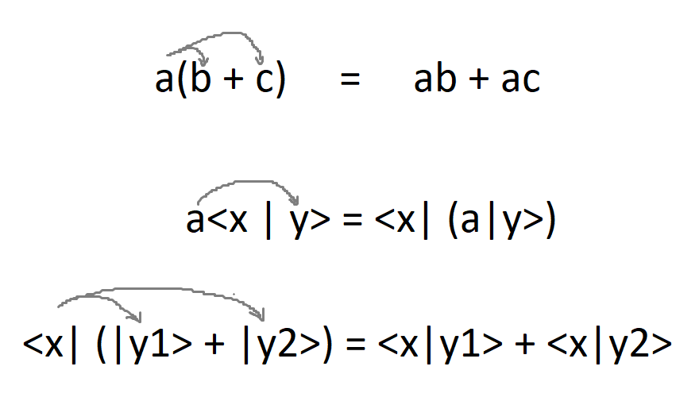

# Inner product
Just like we can take the dot product of two vectors in Euclidean space, we can take what's called the *inner product* of two kets $\ket{\psi}$ and $\ket{\phi}$ in Hilbert space. The inner product of $\ket{\psi}$ and $\ket{\phi}$ is written $\braket{\psi | \phi}$, and results in a scalar:

$$
\text{inner_prod}(\ket{\psi}, \ket{\phi}) = \braket{\psi | \phi} = c,\quad\quad c \in \mathbb{C}.
$$

Typographically, taking the inner product looks like flipping the first ket and sticking it together with the second ket:

$$
\ket{\psi} \ket{\phi} \rightarrow \bra{\psi} \ket{\phi} \rightarrow \braket{\psi | \phi}
$$

This is no accident. That "flipped ket" $\bra{\phi}$ is called a *bra*, and sticking it together with a ket produces a *bra-ket* &mdash; a bracket. This is all part of Dirac notation, and this idea of brackets is why Dirac notation is also commonly called *bra-ket notation*.

!!!info "Properties of the inner product"
    The inner product $\braket{\psi | \phi}$ of kets $\ket{\psi}, \ket{\phi} \in \mathcal{H}$ has the following properties:
    
    **Conjugation**

    We can invert the order of the arguments by taking the **complex conjugate** of the whole thing: $\braket{\psi | \phi} = (\braket{\phi | \psi})^*$, which is usually just written $\braket{\phi | \psi}^*$.

    **Linearity in the second argument**

    If we multiply the inner product with a scalar $a$, we can "move the scalar in" to the **second argument** like so:

    $$
    a\braket{\psi | \phi} = \bra{\psi} a(\ket{\phi}).
    $$

    Furthermore, if the **second argument** of the inner product is a sum of two kets, say $\ket{\phi} = \ket{\phi_1} + \ket{\phi_2}$, we can "distribute" the inner product like so:

    $$
    \bra{\psi} \Bigl(\ket{\phi_1} + \ket{\phi_2}\Bigr) = \braket{\psi | \phi_1} + \braket{\psi | \phi_2}.
    $$

    As you can see from my choice of words above, I like thinking about this property as corresponding to distributing over parentheses in "regular algebra":
    
    { width="300" loading=lazy }

    **Antilinearity in the first argument**

    If the **first argument** is a linear superposition, we can distribute the second argument over the first provided that we take the complex conjugate of any coefficients:

    $$
    \Bigl(a\bra{\psi_1} + b\bra{\psi_2}\Bigr) \ket{\phi} = a^*\braket{\psi_1 | \phi} + b^*\braket{\psi_2 | \phi}
    $$

    This property is a consequence of the previous two.

    **Positivity**

    The inner product of a ket with itself is a **real**, **positive** number that is only equal to zero iff the ket in question is the **null ket** $\ket{\text{null}}$:

    $$
    \begin{align}
        &\braket{\psi | \psi} \geq 0,\newline
        &\braket{\psi | \psi} = 0, \text{ iff } \ket{\psi} = \ket{\text{null}}.
    \end{align}
    $$

    This quantity, $\braket{\psi | \psi}$, is called the **norm** of $\ket{\psi}$ and is also written $\|\ket{\psi}\|^2$ or $|\ket{\psi}|^2$.